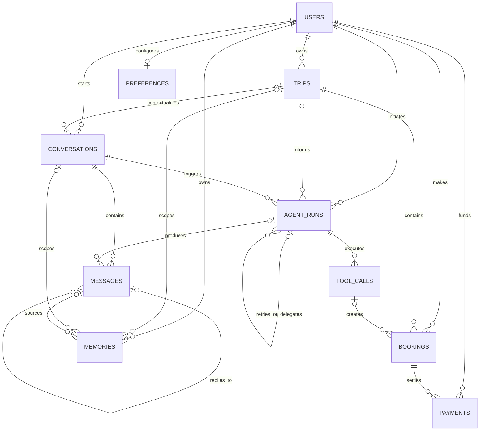

# PostgreSQL Database Design

This document defines the normalized relational model for the AI Travel Agent.
PostgreSQL is the system of record. Redis remains transient coordination
infrastructure, while Qdrant stores a rebuildable semantic index keyed by
`memories.id`.

## Entity-relationship diagram

## Table responsibilities

| Table | Responsibility |
| --- | --- |
| `users` | Application identity mapped to an external OIDC issuer and subject |
| `trips` | User-owned travel plan, schedule, party size, and budget boundary |
| `conversations` | Persistent interaction thread, optionally scoped to a trip |
| `messages` | Immutable ordered transcript entries |
| `bookings` | Provider reservations and their operational state |
| `payments` | Immutable authorization, capture, refund, and void operations |
| `agent_runs` | Durable execution and cost record for an agent workflow |
| `tool_calls` | Sanitized audit record for each MCP tool invocation |
| `preferences` | One optional structured default travel profile per user |
| `memories` | Governed long-term memories with provenance and expiry |

## Relationship rules

- A user can own many trips, conversations, bookings, payments, agent runs, and
  memories, but at most one preference profile.
- A conversation may exist before a trip is created, so `trip_id` is optional.
- Messages are ordered by a conversation-local `sequence_number`.
- An agent run belongs to one user and conversation and may be scoped to a trip.
- A tool call belongs to exactly one agent run.
- A booking may reference the tool call that created it without making the
  booking dependent on retaining that reference.
- A booking can have multiple payment operations, including authorization,
  capture, refund, and void.
- A memory always belongs to a user and may additionally reference its trip,
  conversation, and source message.

## Index strategy

Indexes follow actual access patterns rather than indexing every column:

- User dashboards: `trips(user_id, status, start_date)`.
- Conversation lists: `conversations(user_id, updated_at)`.
- Ordered history: unique `messages(conversation_id, sequence_number)`.
- Worker polling: `agent_runs(status, created_at)`.
- Agent history: `agent_runs(conversation_id, created_at)`.
- Tool audit: `tool_calls(mcp_server, tool_name, created_at)`.
- Booking views: `bookings(user_id, status, created_at)` and
  `bookings(trip_id, status)`.
- Payment history: `payments(booking_id, created_at)`.
- Memory retrieval: `memories(user_id, kind, created_at)`.
- Memory expiry: a partial index containing only rows with `expires_at`.

Primary keys and unique constraints already create indexes in PostgreSQL, so
duplicate indexes are intentionally avoided.

## Constraints

- UUID primary keys prevent sequential identifier exposure and work across
  distributed writers.
- OIDC issuer and subject are unique together; email is not the authentication
  identity.
- Emails are stored lowercase and uniquely constrained.
- Trip and booking end times cannot precede their start times.
- Party size and message/tool sequence numbers must be positive.
- Monetary amounts and token counts cannot be negative.
- Currency and airport codes use uppercase three-character formats.
- Enum columns restrict lifecycle states and tool-risk classifications.
- Idempotency keys prevent duplicate messages, payments, and tool actions.
- Provider references prevent duplicate booking and payment imports.
- Confidence and memory importance are constrained to the interval from zero
  through one.
- Foreign-key delete behavior preserves financial and audit history while
  allowing optional contextual references to become null.

## Normalization

The schema is normalized through third normal form:

1. **First normal form:** every row has a UUID key and scalar domain columns.
   Ordered messages and payment events are separate rows rather than arrays
   embedded in their parent.
2. **Second normal form:** non-key attributes depend on the whole key.
   Conversation-local order and idempotency are enforced with composite unique
   constraints.
3. **Third normal form:** identity, travel plans, transcripts, bookings,
   payments, execution records, tool audits, preferences, and memories have
   independent tables because they have different lifecycles and cardinalities.

Two controlled JSONB exceptions remain:

- Provider-specific booking, payment, message, agent, and tool payloads retain
  external structures that cannot be normalized without coupling the core
  schema to each provider.
- Dietary and accessibility lists remain bounded preference attributes until
  the product needs shared taxonomies, localization, or analytics. At that
  point, they should move to reference and association tables.

JSONB payloads are not authoritative substitutes for relational status,
ownership, monetary, timestamp, or identifier columns. Secrets, payment-card
data, and raw OAuth tokens must never be stored in them.

## Semantic memory boundary

`memories` contains governed source text, provenance, confidence, retention, and
content hashes. Qdrant uses the same UUID as the vector point identifier. This
keeps PostgreSQL authoritative and allows the vector collection to be deleted
and rebuilt without losing memory ownership or retention rules.
