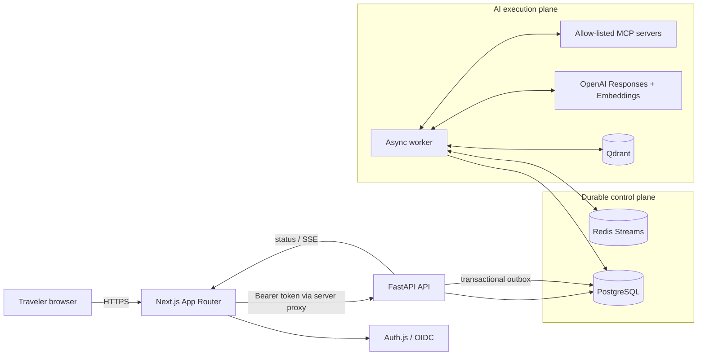
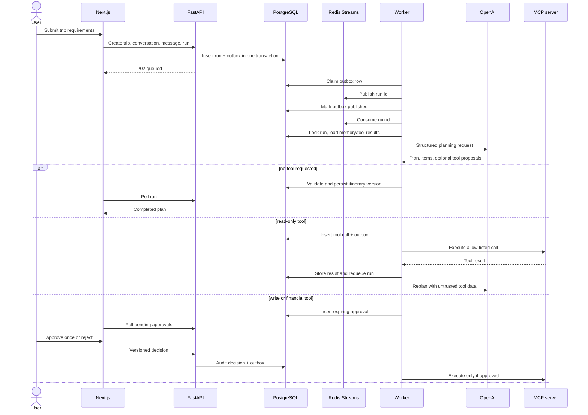

# System architecture

## Component view

### Why each component exists

- **Next.js** renders the application, terminates the browser session, and proxies
  API calls without putting access tokens in local storage.
- **Auth.js/OIDC** delegates identity, MFA, password policy, and account lifecycle
  to an external identity provider.
- **FastAPI** owns validation, tenancy, transactions, approvals, and stable API
  contracts. It does not execute long-running models in request handlers.
- **PostgreSQL** is the source of truth for users, trips, transcripts, agent runs,
  approvals, itineraries, bookings, payments, audit events, and the outbox.
- **Redis Streams** is the low-latency work queue. Consumer groups and
  `XAUTOCLAIM` recover abandoned jobs; duplicated delivery is safe because
  PostgreSQL status/idempotency checks are authoritative.
- **LangGraph** makes planning stages explicit and persists checkpoints in
  PostgreSQL. The graph contains model planning and deterministic validation.
- **OpenAI Responses API** returns schema-constrained plans and proposed tool
  requests. Embeddings support semantic memory retrieval.
- **Qdrant** indexes memory vectors. Every search includes an exact `user_id`
  filter; PostgreSQL remains the authoritative memory record.
- **MCP gateway** exposes only configured server/tool pairs. The platform, not the
  model, assigns risk and scopes.
- **Worker** isolates slow and retryable AI/tool work from HTTP latency and
  orchestrates outbox, graph, memory, and recovery.

## Planning and approval sequence

## Transactional outbox

The API never commits a run and then makes a best-effort Redis call. It commits
the aggregate and an outbox row together. A worker locks due rows with
`SKIP LOCKED`, publishes, and then marks them published. A crash after publication
but before the final commit can duplicate a message; run/tool status checks and
idempotency constraints make that safe. This is deliberate at-least-once
delivery.

## Trust boundaries

Model output, semantic memory, tool output, and user text are untrusted data.
Pydantic constrains model output, deterministic validation rejects unsupported
transactional claims, MCP names are resolved against an exact allow list, and
side effects require durable human approval. Provider tokens are environment
secrets referenced by name and are never written to agent state or audit payloads.

## Data ownership

Every user-owned aggregate carries `user_id`. Services include that identifier in
lookups before returning or mutating data. Foreign keys preserve relational
integrity, while API ownership checks prevent cross-tenant object references.
Qdrant payloads repeat `user_id` only to enforce vector filtering; PostgreSQL is
still the source of truth.

## Failure behavior

- API dies before commit: neither aggregate nor outbox exists.
- API dies after commit: dispatcher later publishes the pending event.
- Worker dies during a Redis job: another worker claims it after the idle timeout.
- Duplicate run job: row status check makes it a no-op.
- Qdrant indexing fails: PostgreSQL memory remains and the Redis message stays
  pending for recovery.
- MCP call fails: the tool and run record a terminal generic failure; no write is
  silently retried outside idempotency/approval controls.
- Approval expires: it cannot be executed and must be proposed again.

## Scaling

API pods are stateless and horizontally scalable. Workers scale independently,
with PostgreSQL row locks and Redis consumer groups coordinating concurrency.
Managed PostgreSQL, Redis, and Qdrant should be deployed across failure domains.
The API HPA handles request load; worker scaling should use queue-depth metrics in
the target platform.
